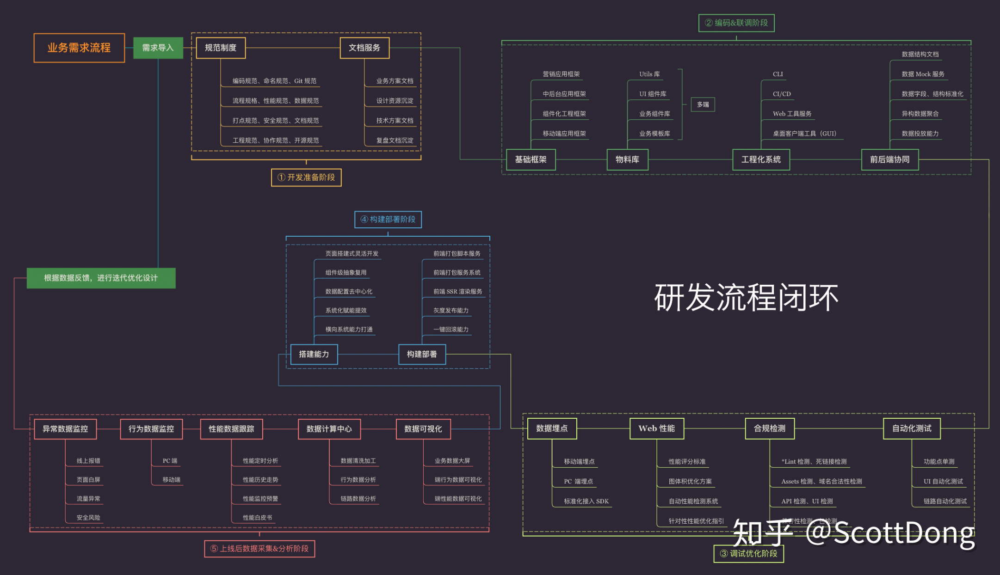

# 在构建新网站或维护网站时，您能解释一下您用来提高性能的一些技术吗？
在构建新网站或维护现有网站时，提高性能是确保用户体验和站点效率的重要方面。以下是一些常见的技术和策略，用于优化网站性能：

### 前端性能优化

1. **压缩和合并文件：**
    - **CSS 和 JavaScript 压缩**：使用工具如 UglifyJS、Terser、CSSNano 来压缩代码，移除不必要的空格、注释等。
    - **文件合并**：将多个 CSS 和 JavaScript 文件合并成一个文件，减少 HTTP 请求的数量。

2. **使用内容分发网络（CDN）：**
    - **CDN**：将静态资源（如图像、CSS、JavaScript 文件）分发到多个地理位置的服务器，减少延迟并提高加载速度。

3. **图片优化：**
    - **图像压缩**：使用工具如 ImageOptim、TinyPNG、JPEG-Optimizer 压缩图像大小而不明显损失质量。
    - **现代图像格式**：使用 WebP 等现代图像格式，提供更好的压缩比。

4. **延迟加载（Lazy Loading）：**
    - **图片和视频延迟加载**：只在用户滚动到可视区域时加载图片和视频，减少初始加载时间。
    - **惰性加载脚本**：使用 `async` 或 `defer` 属性异步加载 JavaScript 文件，避免阻塞渲染。

5. **浏览器缓存：**
    - **缓存静态资源**：通过设置适当的 HTTP 头（如 `Cache-Control`、`ETag`），使浏览器缓存静态资源，减少重复请求。

6. **使用 HTTP/2：**
    - **HTTP/2**：支持并行请求、头部压缩和服务器推送，显著提高页面加载性能。

7. **减少重绘和重排：**
    - **优化 DOM 操作**：减少直接操作 DOM 的次数，使用文档片段或批量更新。
    - **避免大型、复杂的 CSS 选择器**：使用简单、具体的选择器，提高渲染性能。

8. **启用压缩：**
    - **Gzip/Brotli 压缩**：启用服务器端压缩，减少传输的 HTML、CSS、JavaScript 文件大小。

### 后端性能优化

1. **服务器端缓存：**
    - **页面缓存**：缓存动态生成的页面，减少对数据库的请求。
    - **对象缓存**：缓存常用的数据对象，如数据库查询结果。

2. **数据库优化：**
    - **索引**：创建适当的数据库索引，提高查询性能。
    - **查询优化**：优化 SQL 查询，避免全表扫描，减少查询时间。
    - **数据库连接池**：使用连接池减少连接创建的开销。

3. **使用内容管理系统（CMS）的优化插件：**
    - **缓存插件**：使用缓存插件如 W3 Total Cache、WP Super Cache（针对 WordPress）。
    - **优化数据库插件**：如 WP Optimize，清理冗余数据，提高数据库性能。

### 其他优化技术

1. **减少 HTTP 请求：**
    - **精灵图（Sprite）**：将多个小图标合并成一张图片，通过 CSS 显示对应部分，减少请求数量。
    - **内联小型资源**：将小型 CSS 和 JavaScript 文件内联到 HTML 中，减少请求数量。

2. **使用高效的字体加载：**
    - **字体格式**：使用 WOFF2 等现代字体格式，减小字体文件大小。
    - **字体显示策略**：使用 `font-display` 属性控制字体加载行为，避免闪烁。

3. **优化 CSS 和 JavaScript 的加载顺序：**
    - **关键渲染路径**：优化关键渲染路径，确保关键 CSS 和 JavaScript 最先加载和解析。
    - **异步加载非关键资源**：延迟加载非关键 CSS 和 JavaScript，避免阻塞渲染。

### 性能监测和分析

1. **使用性能监测工具：**
    - **Google Lighthouse**：评估网站性能并提供优化建议。
    - **WebPageTest**：分析页面加载过程，提供详细的性能报告。
    - **Google PageSpeed Insights**：获取页面性能评分和改进建议。

2. **持续性能监测：**
    - **使用监控服务**：如 New Relic、Pingdom，持续监控网站性能，及时发现和解决性能问题。

通过结合使用这些技术和策略，可以显著提高网站的性能，提供更好的用户体验和更高的站点效率。

# 在最近的项目中，您个人采取了哪些措施来提高代码的可维护性？
在最近的项目中，为了提高代码的可维护性，我采取了一些重要的措施。这些措施涵盖了代码组织、规范、文档、测试和工具使用等方面，确保代码不仅在当前项目中易于维护，而且在未来的更新和扩展中也保持良好的可维护性。

### 1. **代码组织和结构**

- **模块化设计**：将代码拆分成独立且功能单一的模块，每个模块只负责一种特定的功能，减少耦合度，提高重用性。
- **文件和目录结构**：采用清晰且有逻辑的文件和目录结构，使得代码更易于导航和理解。例如，将代码分为 `components`、`services`、`utils` 等目录。

### 2. **编码规范**

- **使用代码规范工具**：如 ESLint（针对 JavaScript/TypeScript）、Prettier 等，确保代码风格一致，避免常见的语法错误。
- **遵循编码标准**：采用团队或行业标准的编码规范，如 Airbnb JavaScript Style Guide，确保代码风格一致性和可读性。

### 3. **注释和文档**

- **注释**：在复杂或关键的代码段添加适当的注释，解释代码的目的和逻辑，帮助其他开发者快速理解。
- **文档生成工具**：使用工具如 JSDoc、Typedoc 自动生成代码文档，提供详细的 API 说明和使用示例。
- **README 文件**：在每个模块或项目根目录下提供详细的 README 文件，包含项目简介、安装步骤、使用指南和贡献指南。

### 4. **测试**

- **单元测试**：为核心功能编写单元测试，使用 Jest、Mocha、Chai 等测试框架，确保代码的正确性和稳定性。
- **集成测试**：进行集成测试，验证不同模块之间的交互，使用 Cypress、Selenium 等工具。
- **测试覆盖率**：使用工具如 Istanbul 生成测试覆盖率报告，确保关键代码路径都有测试覆盖。

### 5. **版本控制**

- **Git 分支策略**：采用 Git Flow 或 GitHub Flow 分支管理策略，明确开发、测试和发布分支，确保代码变更的可追溯性和稳定性。
- **详细的提交信息**：遵循约定式提交（Conventional Commits）规范，撰写清晰且有意义的提交信息，帮助理解变更历史。

### 6. **代码审查**

- **代码审查流程**：在每次合并之前进行代码审查，通过 Pull Request 的方式让团队成员进行审查和反馈，发现潜在问题和改进建议。
- **审查工具**：使用 GitHub、GitLab 或 Bitbucket 提供的代码审查工具，确保代码质量和一致性。

### 7. **自动化和持续集成**

- **持续集成（CI）**：使用 CI 工具如 GitHub Actions、Travis CI、Jenkins，自动化测试和构建流程，确保每次代码提交都经过测试验证。
- **自动化部署**：使用持续部署（CD）工具，自动化部署流程，确保代码变更能快速、安全地发布到生产环境。

### 实例应用

在最近的一个前端项目中，我采取了以下具体措施来提高代码的可维护性：

1. **模块化设计**：将组件和功能分为独立的模块，如表单组件、API 服务、实用函数等，每个模块单独维护和测试。
2. **使用 ESLint 和 Prettier**：设置 ESLint 和 Prettier 配置文件，在代码提交时自动格式化和检查代码，保持一致的代码风格。
3. **编写单元测试和集成测试**：为关键功能编写单元测试，并使用 Cypress 进行端到端测试，确保功能的正确性和稳定性。
4. **详细的 README 文件**：在项目根目录和各个模块目录下编写详细的 README 文件，提供安装、使用和开发指南。
5. **代码审查和 CI/CD**：通过 Pull Request 进行代码审查，使用 GitHub Actions 设置持续集成和持续部署流程，自动化测试和部署，提高开发效率。

这些措施显著提高了项目的可维护性，使得团队成员能够更快地理解和修改代码，同时减少了引入错误的风险。

# 您能描述一下创建网页时的工作流程吗？
创建网页时的工作流程通常包括以下几个主要步骤，从项目规划到最终部署，每个步骤都需要精心策划和执行。以下是一个典型的工作流程：

### 1. **项目规划**

- **需求分析**：与客户或项目负责人讨论需求，明确项目目标、功能要求和用户需求。
- **竞品分析**：分析竞争对手的网站，了解行业标准和最佳实践。
- **用户研究**：研究目标用户群体，创建用户画像，明确用户需求和行为习惯。

### 2. **信息架构和线框图**

- **信息架构**：制定网站的整体结构和导航体系，确定主要页面和内容层级。
- **线框图**：创建低保真线框图，展示页面布局和主要元素的位置，确保页面结构合理。

### 3. **设计**

- **视觉设计**：根据线框图制作高保真设计稿，确定颜色、字体、图片和其他视觉元素，确保设计符合品牌形象和用户体验原则。
- **设计工具**：使用设计工具如 Adobe XD、Sketch、Figma 等进行设计，方便与团队协作和原型展示。
- **原型设计**：创建可交互的原型，模拟用户体验，方便进行用户测试和反馈收集。

### 4. **前端开发**

- **HTML 构建**：编写 HTML 代码，搭建页面结构，使用语义化标签提高可访问性和 SEO。
- **CSS 样式**：编写 CSS 代码，进行页面样式和布局设计，确保响应式设计适应不同设备。
- **JavaScript 开发**：编写 JavaScript 代码，实现页面交互和动态效果，使用框架如 React、Vue 或 Angular 提高开发效率。

### 5. **后端开发**

- **服务器设置**：配置服务器环境，选择合适的服务器架构和技术栈（如 Node.js、Python、Ruby）。
- **数据库设计**：设计数据库结构，选择合适的数据库类型（如 MySQL、PostgreSQL、MongoDB），进行数据建模。
- **API 开发**：编写后端代码，创建 RESTful API 或 GraphQL API，实现数据处理和业务逻辑。

### 6. **集成和测试**

- **前后端集成**：将前端页面与后端 API 进行集成，确保数据交互顺畅。
- **功能测试**：进行功能测试，确保所有功能正常运行，使用工具如 Jest、Mocha 进行单元测试和集成测试。
- **用户测试**：进行用户测试，收集用户反馈，进行必要的调整和优化。

### 7. **优化和性能调优**

- **代码优化**：优化代码结构和逻辑，提高代码可维护性和性能，减少冗余代码。
- **性能优化**：优化页面加载速度，压缩和合并文件，使用内容分发网络（CDN），进行图片和资源的懒加载。
- **SEO 优化**：进行搜索引擎优化，编写有效的 meta 标签，优化内容结构和关键词使用。

### 8. **部署和发布**

- **测试环境部署**：将代码部署到测试环境，进行全面的测试和验收。
- **生产环境部署**：将代码部署到生产环境，配置服务器和数据库，确保网站稳定运行。
- **持续集成/持续部署（CI/CD）**：设置 CI/CD 流程，使用工具如 GitHub Actions、Travis CI、Jenkins，自动化构建、测试和部署。

### 9. **维护和更新**

- **监控和分析**：使用监控工具如 Google Analytics、New Relic 监控网站性能和用户行为，及时发现和解决问题。
- **定期更新**：根据用户反馈和业务需求，定期更新和优化网站功能和内容。
- **安全维护**：进行安全审计和漏洞修复，确保网站安全性。

### 实际应用

在最近的一个电商网站项目中，我遵循了上述工作流程，具体步骤如下：

1. **需求分析**：与客户讨论电商网站的功能需求，如产品展示、购物车、支付系统等。
2. **信息架构**：制定网站的导航结构和主要页面，包括首页、产品页、购物车页、结账页等。
3. **设计**：使用 Figma 创建高保真设计稿，并与客户反复沟通确认设计细节。
4. **前端开发**：使用 React 构建前端页面，编写响应式 CSS，确保在移动设备上的良好体验。
5. **后端开发**：使用 Node.js 和 Express.js 开发后端 API，连接 MongoDB 数据库，处理用户数据和订单信息。
6. **测试**：进行全面的功能测试和用户测试，收集反馈并进行优化。
7. **优化和性能调优**：优化页面加载速度，使用 CDN 和懒加载技术，提高用户体验。
8. **部署和发布**：使用 GitHub Actions 设置 CI/CD 流程，自动化构建、测试和部署代码到 AWS 服务器。
9. **维护和更新**：监控网站性能，定期发布更新，处理用户反馈，确保网站持续稳定运行。

通过这样的工作流程，确保项目从初期规划到最终部署都能够有条不紊地进行，提高了项目的质量和交付效率。

# 解释 CSS 动画与 JavaScript 动画的一些优缺点。
CSS 动画和 JavaScript 动画各有其优缺点，具体选择哪一种取决于项目需求、性能要求以及开发人员的熟悉程度。以下是两者的优缺点比较：

### CSS 动画

#### 优点

1. **性能优化：**
    - **硬件加速**：CSS 动画通常由浏览器优化并且可以利用硬件加速，特别是对于简单的动画如变换、透明度和滚动效果。
    - **浏览器优化**：浏览器可以更高效地处理 CSS 动画，因为它们在合成层运行，不需要重绘或重排。

2. **简洁语法：**
    - **易于使用**：使用 `@keyframes` 和 `transition` 属性，定义和管理动画相对简单且直观，适合简单的动画效果。
    - **CSS 样式集中**：所有的样式和动画逻辑都集中在 CSS 文件中，保持 HTML 和 JavaScript 文件的整洁。

3. **减少 JavaScript 负担：**
    - **分离关注点**：将动画逻辑从 JavaScript 中分离出来，有助于维护和组织代码。

#### 缺点

1. **灵活性有限：**
    - **复杂动画**：对于复杂的动画效果（如需要计算中间帧或交互动画），CSS 动画可能难以实现或不够灵活。
    - **事件驱动**：CSS 动画缺乏与 JavaScript 事件的深度交互，无法动态控制动画的中途状态。

2. **浏览器兼容性：**
    - **部分属性不支持**：一些 CSS 动画属性可能在旧版浏览器中不受支持，需要考虑兼容性问题。

### JavaScript 动画

#### 优点

1. **高度灵活性：**
    - **复杂动画**：可以通过计算和逻辑实现非常复杂和细致的动画效果，适用于游戏或高度交互的用户界面。
    - **动态控制**：能够实时控制动画的各个方面，轻松实现暂停、恢复、加速等操作。

2. **事件驱动：**
    - **深度交互**：可以结合用户交互（如鼠标移动、点击等）实时更新动画，提供更丰富的用户体验。

3. **库和框架支持：**
    - **丰富的动画库**：有许多优秀的 JavaScript 动画库（如 GSAP、Anime.js）提供强大的功能和简便的 API，大大简化动画开发。

#### 缺点

1. **性能问题：**
    - **可能更耗资源**：JavaScript 动画可能比 CSS 动画更耗费浏览器资源，特别是在处理大量 DOM 元素或复杂计算时。
    - **主线程运行**：JavaScript 动画运行在浏览器的主线程上，可能会导致页面重绘和重排，从而影响性能。

2. **代码复杂性：**
    - **增加代码量**：复杂的动画逻辑会增加 JavaScript 代码量，可能导致代码维护性和可读性下降。

### 实际应用场景

#### 选择 CSS 动画的场景：
- **简单的过渡和转换**：如 hover 效果、淡入淡出、元素位置变化等。
- **加载动画**：简单的加载动画或循环动画。
- **状态变更**：当元素状态变更时触发的动画，如按钮点击后的视觉反馈。

#### 选择 JavaScript 动画的场景：
- **复杂和精细的动画**：如游戏动画、交互复杂的界面动画、需要动态计算中间帧的动画。
- **用户交互动画**：依赖于用户输入的动画效果，如拖拽、滑动等。
- **需要动态控制的动画**：如播放控制（暂停、继续、跳转）等功能。

### 综合考虑

在实际项目中，开发人员经常结合使用 CSS 和 JavaScript 动画。例如，使用 CSS 处理简单的过渡效果，而使用 JavaScript 处理需要复杂逻辑和用户交互的动画效果。这样的组合可以发挥两者的优势，同时减少性能开销和代码复杂性。

# CORS 代表什么？它解决什么问题？
CORS（Cross-Origin Resource Sharing，跨域资源共享）是一种机制，允许受限制的资源（如字体、JavaScript）从一个域加载到另一个域。它通过使用额外的 HTTP 头来告知浏览器，允许来自源（domain）的哪些资源请求可以被接受。

### CORS 解决的问题

在现代浏览器中，出于安全考虑，存在一种称为“同源策略”（Same-Origin Policy）的限制。该策略禁止在一个源（域名、协议和端口）加载的网页从另一个源请求资源。这个策略防止了恶意网站读取用户敏感数据。

例如，如果你在 `http://example.com` 上访问一个页面，这个页面试图通过 AJAX 请求访问 `http://api.anotherdomain.com/data`，浏览器会阻止这个请求，因为它们不属于同一个源。

### CORS 具体解决的问题

1. **跨域请求**：
    - 同源策略限制了跨域请求，CORS 允许服务器明确指出哪些域名可以访问其资源，解决了跨域请求的问题。

2. **资源共享**：
    - 在微服务架构中，不同服务之间需要共享资源，CORS 允许不同域的服务安全地相互访问资源。

3. **第三方 API 访问**：
    - 前端应用需要访问第三方 API，CORS 允许服务器定义哪些域可以访问其 API，使得前端应用可以安全地进行跨域数据请求。

### CORS 的工作机制

CORS 的工作通过 HTTP 头来实现，主要包括以下几个步骤和头部：

1. **简单请求**：
    - 如果请求是“简单请求”，浏览器会直接发送请求，并且服务器通过响应头决定是否允许跨域请求。简单请求包括 `GET`、`POST`（Content-Type 为 `application/x-www-form-urlencoded`, `multipart/form-data`, `text/plain`）和 `HEAD` 方法。

   ```http
   GET /data HTTP/1.1
   Host: api.anotherdomain.com
   Origin: http://example.com

   HTTP/1.1 200 OK
   Access-Control-Allow-Origin: http://example.com
   ```

2. **预检请求（Preflight Request）**：
    - 对于非简单请求（如 `PUT`, `DELETE`, `Content-Type` 为 JSON 的 `POST` 请求），浏览器会先发送一个 `OPTIONS` 请求，称为预检请求，询问服务器是否允许实际请求。

   ```http
   OPTIONS /data HTTP/1.1
   Host: api.anotherdomain.com
   Origin: http://example.com
   Access-Control-Request-Method: POST

   HTTP/1.1 200 OK
   Access-Control-Allow-Origin: http://example.com
   Access-Control-Allow-Methods: POST
   ```

3. **响应头**：
    - `Access-Control-Allow-Origin`：指定允许访问资源的源。
    - `Access-Control-Allow-Methods`：指定允许的 HTTP 方法。
    - `Access-Control-Allow-Headers`：指定允许的请求头。
    - `Access-Control-Allow-Credentials`：指示是否允许发送 Cookie。
    - `Access-Control-Expose-Headers`：允许前端 JavaScript 代码访问的响应头。
    - `Access-Control-Max-Age`：指示预检请求的缓存时间。

### 例子

假设你有一个 API 服务器位于 `http://api.example.com`，你希望允许位于 `http://frontend.example.com` 的前端应用访问这个 API，可以在服务器上配置 CORS：

```http
HTTP/1.1 200 OK
Access-Control-Allow-Origin: http://frontend.example.com
Access-Control-Allow-Methods: GET, POST, PUT, DELETE
Access-Control-Allow-Headers: Content-Type
Access-Control-Allow-Credentials: true
```

### 实际应用

- **前端开发**：在前端开发中，经常需要跨域请求数据，例如在 React 或 Vue.js 项目中请求第三方 API 数据。
- **后端开发**：后端服务器需要配置 CORS 头，以允许前端应用安全地访问其资源。
- **微服务架构**：在微服务架构中，服务之间需要跨域请求和数据共享，CORS 配置是常见的需求。

通过正确配置 CORS，可以安全且灵活地解决跨域资源访问问题，确保前端和后端服务之间的数据交换安全可靠。

# 您能解释一下当您在浏览器中输入 URL 时会发生什么吗？
当在浏览器中输入 URL 并按下回车键时会发生的步骤：

### 1. **URL 解析**

首先，浏览器会解析你输入的 URL，例如 `https://www.example.com/path?query=string#fragment`。URL 被分解成以下几个部分：
- **协议**：`https`
- **域名**：`www.example.com`
- **路径**：`/path`
- **查询字符串**：`?query=string`
- **片段标识符**：`#fragment`

### 2. **DNS 解析**

浏览器需要将域名 `www.example.com` 转换成 IP 地址。以下是详细的解析过程：
1. **浏览器缓存**：浏览器首先会检查自身的 DNS 缓存，看是否有该域名的 IP 地址。
2. **操作系统缓存**：如果浏览器缓存没有，浏览器会查询操作系统的 DNS 缓存。
3. **路由器缓存**：如果操作系统缓存也没有，操作系统会查询本地网络设备（如路由器）的 DNS 缓存。
4. **ISP DNS 服务器**：如果路由器缓存也没有，路由器会向 ISP（互联网服务提供商）的 DNS 服务器发送查询请求。
5. **递归查询**：ISP 的 DNS 服务器如果没有缓存该域名，会递归查询其他 DNS 服务器，直到找到权威 DNS 服务器以获得该域名的 IP 地址。

DNS 解析结果是一个或多个 IP 地址，浏览器选择其中一个用于后续步骤。

### 3. **TCP 连接**

获得 IP 地址后，浏览器会与目标服务器建立 TCP 连接。TCP 连接的建立过程称为“三次握手”：
1. **客户端发送 SYN 包**：客户端向服务器发送一个 SYN（同步序列编号）包，请求建立连接。
2. **服务器回复 SYN-ACK 包**：服务器收到 SYN 包后，回复一个 SYN-ACK（同步序列编号和确认编号）包，表示同意建立连接。
3. **客户端回复 ACK 包**：客户端收到 SYN-ACK 包后，回复一个 ACK（确认编号）包，确认连接建立。

### 4. **发送 HTTP/HTTPS 请求**

TCP 连接建立后，浏览器会根据 URL 协议发送 HTTP 或 HTTPS 请求：

- **HTTP 请求**：直接发送 HTTP 请求。
- **HTTPS 请求**：先进行 TLS 握手，建立加密连接。TLS 握手过程：
    1. **客户端发送 ClientHello 消息**：包含支持的加密算法、协议版本等信息。
    2. **服务器回复 ServerHello 消息**：包含服务器选择的加密算法和服务器证书。
    3. **客户端验证服务器证书**：验证证书是否合法，可信任。
    4. **生成会话密钥**：客户端生成会话密钥，并使用服务器的公钥加密发送给服务器。
    5. **建立加密连接**：服务器解密会话密钥，客户端和服务器使用会话密钥进行加密通信。

然后浏览器发送 HTTP 请求报文，包含：
- **请求行**：如 `GET /path HTTP/1.1`
- **请求头**：如 `Host: www.example.com`、`User-Agent`、`Accept` 等
- **请求体**：对于 POST 等方法包含请求数据

### 5. **服务器处理请求**

服务器收到请求后，处理该请求并生成响应：
1. **路由处理**：根据请求路径和方法，确定调用哪个处理函数或控制器。
2. **业务逻辑处理**：处理业务逻辑，可能包括数据库查询、数据处理等。
3. **生成响应**：生成 HTTP 响应报文，包括状态行、响应头和响应体。

### 6. **发送响应**

服务器将生成的 HTTP 响应报文通过 TCP 连接发送回客户端。响应报文包括：
- **状态行**：如 `HTTP/1.1 200 OK`
- **响应头**：如 `Content-Type: text/html`、`Content-Length`、`Set-Cookie` 等
- **响应体**：包含实际的网页内容，如 HTML、CSS、JavaScript、图像等

### 7. **浏览器渲染页面**

浏览器收到响应后，开始渲染网页。渲染过程包括以下步骤：

1. **构建 DOM 树**：
    - 浏览器解析 HTML 文档，创建 Document Object Model（DOM）树，表示 HTML 文档的结构和内容。

2. **构建 CSSOM 树**：
    - 浏览器解析 CSS 文件和内联样式，创建 CSS Object Model（CSSOM）树，表示样式信息。

3. **合成渲染树**：
    - 将 DOM 树和 CSSOM 树合并，生成渲染树。渲染树包含每个节点的样式和布局信息。

4. **布局（重排）**：
    - 浏览器计算每个节点的位置和大小，确定页面布局。

5. **绘制**：
    - 将渲染树中的节点绘制到屏幕上，显示网页内容。

### 8. **执行 JavaScript**

浏览器会下载并执行网页中的 JavaScript 代码。JavaScript 可能会操作 DOM，更新页面内容，处理用户交互，发送异步请求等。

### 9. **处理其他资源请求**

在解析 HTML 时，浏览器会发现需要加载的其他资源（如 CSS 文件、JavaScript 文件、图像等），并发起相应的请求。这些请求大多是并行的，以提高加载速度。

### 10. **用户交互**

网页渲染完成后，用户可以与页面交互（如点击、滚动等）。浏览器会根据用户的操作更新页面，包括重排和重绘。

### 总结

整个过程涉及多种技术和协议，从输入 URL 到网页渲染完成，浏览器、操作系统和网络服务之间协同工作，确保最终将网页正确地展示给用户。这个流程的各个阶段都至关重要，任何一环出现问题都会影响用户体验。

这就是当你在浏览器中输入 URL 并按下回车键时，浏览器背后所发生的详细步骤。

# 描述 SSR 和 CSR 之间的区别。讨论其优缺点。
### 服务器端渲染 (Server-Side Rendering, SSR) 和 客户端渲染 (Client-Side Rendering, CSR) 的区别

**服务器端渲染 (SSR)** 是指在服务器上生成 HTML，然后将生成的 HTML 发送到客户端。客户端只需接收并显示这些 HTML 内容。

**客户端渲染 (CSR)** 是指在客户端（通常是浏览器）上生成 HTML 内容。初始页面是一个最小的 HTML 骨架，主要的内容通过 JavaScript 在客户端生成。

### SSR 和 CSR 的具体区别

#### 服务器端渲染 (SSR)

1. **工作原理**：
    - 用户请求页面。
    - 服务器处理请求，执行应用逻辑。
    - 服务器生成完整的 HTML 页面。
    - 服务器将生成的 HTML 页面发送给客户端。
    - 浏览器显示接收到的完整 HTML 页面。

2. **优点**：
    - **快速首次渲染**：因为完整的 HTML 是由服务器生成并发送的，浏览器可以立即显示内容，尤其对用户第一次访问时更友好。
    - **SEO 友好**：搜索引擎可以轻松地抓取和索引完整的 HTML 内容，有助于提高网站的搜索引擎排名。
    - **更好的性能**：在低性能设备上表现更好，因为主要的渲染工作由服务器完成。

3. **缺点**：
    - **服务器压力大**：每个请求都需要服务器生成完整的 HTML 页面，服务器负载高，尤其是高并发场景下。
    - **较差的用户交互体验**：页面间的切换通常需要完全刷新，用户体验较差。
    - **开发复杂度高**：需要处理更多的服务器端逻辑，尤其是在使用现代前端框架时，需要额外的配置和工具链支持 SSR。

#### 客户端渲染 (CSR)

1. **工作原理**：
    - 用户请求页面。
    - 服务器返回一个基本的 HTML 文件，其中包含一个指向 JavaScript 文件的引用。
    - 浏览器下载和执行 JavaScript 文件。
    - JavaScript 文件在客户端生成并插入 HTML 内容。
    - 浏览器显示由 JavaScript 动态生成的页面内容。

2. **优点**：
    - **减少服务器负载**：初始请求只是一个简单的 HTML 文件和静态资源，服务器压力较小。
    - **更好的用户交互体验**：页面间的切换更流畅，无需完全刷新，用户体验更好。
    - **开发灵活性高**：现代前端框架（如 React、Vue、Angular）提供了丰富的工具和生态系统，便于开发和维护复杂的单页应用（SPA）。

3. **缺点**：
    - **首次加载时间较长**：初始页面需要加载大量的 JavaScript 文件，首次渲染可能较慢。
    - **SEO 不友好**：搜索引擎对纯客户端渲染的内容抓取和索引较为困难，需要额外的处理（如使用预渲染或动态渲染）。
    - **依赖于客户端性能**：页面渲染工作在客户端完成，低性能设备可能会导致渲染速度慢，用户体验差。

### SSR 和 CSR 的选择

#### 选择 SSR 的场景：
- **SEO 要求高**：内容需要被搜索引擎抓取和索引，比如博客、新闻网站。
- **首次渲染速度要求高**：需要快速展示内容，比如电商网站的产品页。
- **服务器资源充足**：能够处理高并发和高负载的服务器环境。

#### 选择 CSR 的场景：
- **高交互性需求**：用户需要频繁交互，页面切换流畅，比如单页应用（SPA）。
- **开发效率要求高**：需要快速开发和迭代的项目，使用现代前端框架和工具链。
- **服务器资源有限**：服务器负载较重，希望将部分计算转移到客户端。

### 总结

**SSR 和 CSR 各有优缺点**，具体选择取决于项目的需求和约束。在实际开发中，往往会结合两者的优势，采用混合渲染（Hydration）的方式，即初始页面使用 SSR 生成，随后在客户端通过 CSR 提升用户交互体验。这种方式可以兼顾首次渲染速度和用户体验，同时也有利于 SEO。

# 如何提供包含多种语言内容的页面？
提供多种语言内容的页面涉及国际化（i18n）和本地化（l10n）。以下是实现多语言支持的步骤和最佳实践：

### 1. **准备和规划**

- **确定支持的语言**：根据目标用户和市场需求，确定需要支持的语言。
- **选择国际化框架或库**：选择适合的国际化框架或库，比如 i18next、react-i18next、vue-i18n、angular-i18n 等。
- **结构化文件和内容**：设计良好的文件结构以存储不同语言的内容，通常是 JSON 文件或其他格式。

### 2. **提取和管理翻译字符串**

- **提取翻译字符串**：将页面中的文本提取为翻译字符串，使用占位符替换动态内容。
  ```json
  // en.json
  {
    "welcome": "Welcome, {{name}}!",
    "description": "This is an example of internationalization."
  }
  // zh.json
  {
    "welcome": "欢迎, {{name}}!",
    "description": "这是国际化的示例。"
  }
  ```

### 3. **配置国际化库**

- 以 React 应用为例，使用 i18next 和 react-i18next：
  ```bash
  npm install i18next react-i18next
  ```

  ```javascript
  // i18n.js
  import i18n from 'i18next';
  import { initReactI18next } from 'react-i18next';
  import en from './locales/en.json';
  import zh from './locales/zh.json';

  i18n
    .use(initReactI18next)
    .init({
      resources: {
        en: { translation: en },
        zh: { translation: zh }
      },
      lng: 'en',
      fallbackLng: 'en',
      interpolation: {
        escapeValue: false
      }
    });

  export default i18n;
  ```

### 4. **在组件中使用翻译**

在 React 组件中使用 `useTranslation` 钩子：
  ```javascript
  import React from 'react';
  import { useTranslation } from 'react-i18next';

  const MyComponent = () => {
    const { t } = useTranslation();

    return (
      <div>
        <h1>{t('welcome', { name: 'John' })}</h1>
        <p>{t('description')}</p>
      </div>
    );
  };

  export default MyComponent;
  ```

### 5. **语言切换**

提供语言切换功能，让用户选择他们的偏好语言：
  ```javascript
  const LanguageSwitcher = () => {
    const { i18n } = useTranslation();

    const changeLanguage = (lng) => {
      i18n.changeLanguage(lng);
    };

    return (
      <div>
        <button onClick={() => changeLanguage('en')}>English</button>
        <button onClick={() => changeLanguage('zh')}>中文</button>
      </div>
    );
  };

  export default LanguageSwitcher;
  ```

### 6. **处理日期、时间和货币格式**

- 使用库如 `moment.js`、`date-fns`、`Intl` API 来处理不同语言的日期、时间和货币格式。
  ```javascript
  const date = new Date();
  const formattedDate = new Intl.DateTimeFormat('zh-CN').format(date);
  console.log(formattedDate); // 2024/5/23
  ```

### 7. **搜索引擎优化 (SEO)**

- **hreflang 标签**：在 HTML `<head>` 中使用 `hreflang` 标签告诉搜索引擎页面的语言和地区版本。
  ```html
  <link rel="alternate" href="https://example.com/en" hreflang="en">
  <link rel="alternate" href="https://example.com/zh" hreflang="zh">
  ```

- **URL 结构**：设计 URL 结构以反映不同语言，比如 `https://example.com/en/` 和 `https://example.com/zh/`。

### 8. **服务器端渲染 (SSR) 支持**

- 在使用 SSR 的框架如 Next.js 时，确保服务器端也能正确处理语言和内容。
  ```javascript
  // next.config.js
  module.exports = {
    i18n: {
      locales: ['en', 'zh'],
      defaultLocale: 'en'
    }
  };
  ```

### 9. **测试**

- 测试每种语言的页面，确保翻译准确且没有破坏布局。
- 使用工具如翻译管理平台（如 Transifex、Crowdin）来管理和更新翻译。

### 10. **用户体验**

- 保存用户选择的语言偏好，可以使用 Cookies 或 localStorage。
  ```javascript
  // 保存用户选择的语言
  localStorage.setItem('language', 'zh');

  // 页面加载时设置语言
  const language = localStorage.getItem('language') || 'en';
  i18n.changeLanguage(language);
  ```

通过这些步骤，你可以创建一个多语言支持的网页，提升用户体验并覆盖更广泛的用户群体。

# 描述 localStorage和sessionStorage之间的区别
`localStorage` 和 `sessionStorage` 都是 HTML5 提供的 Web Storage API 的一部分，它们都允许在浏览器中存储数据。它们之间的区别主要体现在数据的生命周期和作用域上：

### 1. 生命周期

- **localStorage**：存储在 `localStorage` 中的数据没有过期时间，会一直保留在浏览器中，除非被显式删除。

- **sessionStorage**：存储在 `sessionStorage` 中的数据仅在当前会话（当前标签页或窗口）有效。一旦会话结束（关闭标签页或窗口），数据就会被销毁。

### 2. 作用域

- **localStorage**：存储在 `localStorage` 中的数据在同一域名下的所有页面和窗口中都是共享的。即使是不同的标签页或窗口也可以访问相同的 `localStorage` 数据。

- **sessionStorage**：存储在 `sessionStorage` 中的数据仅在同一会话中有效。每个标签页或窗口都有自己独立的 `sessionStorage` 存储空间，页面之间无法共享数据。

### 3. 使用场景

- **localStorage** 适用于需要持久保存的数据，比如用户的偏好设置、登录凭据等。因为数据不会过期，可以在用户下次访问时保持状态。

- **sessionStorage** 适用于临时保存的数据，比如表单数据、页面状态等。因为数据仅在当前会话中有效，关闭标签页或窗口时就会自动销毁，不会留下垃圾数据。

总的来说，`localStorage` 和 `sessionStorage` 都是用于在浏览器中存储数据的方式，但它们的生命周期和作用域不同，适用于不同的使用场景。

# 什么是渐进式渲染？
渐进式渲染是一种通过在网页加载过程中逐步显示内容的策略，以改善用户体验和页面性能的方法。它的核心思想是尽快展示页面的部分内容，而不是等待整个页面完全加载后再显示。

### 渐进式渲染的特点：

1. **分阶段加载**：页面内容被分为多个部分，每个部分根据其重要性和优先级进行加载和渲染，而不是等待整个页面内容加载完成。

2. **逐步显示**：随着内容逐渐加载完成，用户能够看到页面上越来越多的内容，从而获得更快的视觉反馈。

3. **优先加载关键内容**：首先加载并渲染对用户体验至关重要的内容，如页面主体结构、标题、关键文本等。

4. **增量渲染**：页面内容可以通过 JavaScript 动态加载，例如懒加载图片、无限滚动列表等，进一步提升性能和用户体验。

### 渐进式渲染的优势：

- **更快的首次渲染**：用户能够更快地看到页面内容，减少等待时间，提升用户满意度和留存率。

- **更好的用户体验**：逐步显示页面内容可以给用户更好的反馈，让用户感觉页面加载速度更快，提升整体体验。

- **更好的性能表现**：通过优先加载和渲染关键内容，可以减少页面加载时间，降低服务器和客户端的负载。

### 示例：

- **渐进式图像加载**：图片可以首先展示模糊或低分辨率的预览图，然后在后台逐步加载高分辨率的图像，提供更快的视觉反馈。

- **无限滚动列表**：在滚动时动态加载列表项，以提供更快的响应时间，并避免一次性加载大量数据导致页面卡顿。

总之，渐进式渲染是一种优化页面加载和性能的方法，它可以通过逐步显示页面内容，提升用户体验、减少等待时间，同时降低服务器和客户端的负载。

# HTTP和HTTPS有什么区别

**HTTP和HTTPS是什么？**

我们都知道使用浏览器访问一个网站页面，需要知道该网站的域名，在浏览器的地址栏中我们会看到一串URL，如图


网站的URL会分为两部分：通信协议和域名地址。

域名地址都很好理解，不同的域名地址表示网站中不同的页面，而通信协议，简单来说就是浏览器和服务器之间沟通的语言。网站中的通信协议一般就是HTTP协议和HTTPS协议。两者分别是什么，有什么区别呢？


**HTTP协议**

HTTP协议也就是超文本传输协议，是一种使用明文数据传输的网络协议。一直以来HTTP协议都是最主流的网页协议，HTTP协议被用于在Web浏览器和网站服务器之间传递信息，以明文方式发送内容，不提供任何方式的数据加密，如果攻击者截取了Web浏览器和网站服务器之间的传输报文，就可以直接读懂其中的信息。


互联网发展到今天，HTTP协议的明文传输会让用户存在非常大的安全隐患。试想一下，假如你在一个HTTP协议的网站上面购物，你需要在页面上输入你的银行卡号和密码，然后你把数据提交到服务器实现购买。假如这个环节稍有不慎，你的传输数据被第三者给截获了，由于HTTP明文数据传输的原因，你的银行卡号和密码，将会被这个截获人所得到。现在你还敢在一个HTTP的网站上面购物吗？你还会在一个HTTP的网站上面留下你的个人信息吗？

**HTTPS协议**

为了解决HTTP协议的这一缺陷，需要使用另一种协议：安全套接字层超文本传输协议HTTPS，为了数据传输的安全，HTTPS在HTTP的基础上加入了SSL/TLS协议，SSL/TLS依靠证书来验证服务器的身份，并为浏览器和服务器之间的通信加密。HTTPS协议可以理解为HTTP协议的升级，就是在HTTP的基础上增加了数据加密。在数据进行传输之前，对数据进行加密，然后再发送到服务器。这样，就算数据被第三者所截获，但是由于数据是加密的，所以你的个人信息仍然是安全的。这就是HTTP和HTTPS的最大区别。


HTTPS协议是由SSL/TLS+HTTP协议构建的可进行加密传输、身份认证的网络协议，要比http协议安全，很多大型互联网网站，如百度、淘宝、腾讯很早就已经把HTTP换成HTTPS了。

**HTTP和HTTPS的区别**


1.安全性不同

https://前缀表明是用SSL (安全套接字)或TSL加密的，你的电脑与服务器之间收发的信息传输将更加安全。当你使用浏览器访问一个HTTP网站的时候，你会发现浏览器会对该HTTP网站显示“不安全”的安全警告，提示用户当前所访问的网站可能会存在风险。


而假如你访问的是一个HTTPS网站时，情况却是完全不一样。你会发现浏览器的地址栏会变成绿色，企业名称会展示在地址栏中，地址栏上面还会出现一把“安全锁”的图标。这些都会给予用户很大的视觉上的安全体验。


2.网站申请流程不同

https协议需要到CA申请证书，一般免费证书很少，需要交费，Web服务器启用SSL需要获得一个服务器证书并将该证书与要使用SSL的服务器绑定。

3.默认端口不同

http和https使用的是完全不同的连接方式，同时使用的端口也不同，http使用的是80端口，https使用的是443端口。在网络模型中，HTTP工作于应用层，而HTTPS工作在传输层。

4.对搜索排名的提升

这也是很多站长所关注的地方。百度和谷歌两大搜索引擎都已经明确表示，HTTPS网站将会作为搜索排名的一个重要权重指标。也就是说HTTPS网站比起HTTP网站在搜索排名中更有优势。

HTTPS网站相比起HTTP网站拥有着多种的优势，HTTP明显已经不能适应当今这个互联网时代，可以预见到HTTP在不久的将来将会全面被HTTPS所取代。

# HTTP组成

每条HTTP报文都包含一个来自客户端的请求，或者一条来自服务器的响应。HTTP报文分两类：请求报文和响应报文。不管是请求报文还是响应报文每条HTTP报文是由3部分组成，分别是：**1、起始行 2、首部 3、主体**


**一、起始行**

**请求行和响应行**

**请求行：**请求报文请求服务器对资源进行一些操作。通俗讲就是客户端想服务器发起请求的请求命令。包含了

方法：如：get、post等

请求URL：如：/src/test.pdf

版本号：版本号是指HTTP/1.1或HTTP/2.0等


**响应行：**响应报文承载了状态信息和操作产生的所有结果数据，将其返回给客户端。包含了响应报文使用的HTTP版本，状态码（如：200、404等），以及描述操作状态的文本形式的原因短语。


**版本号：**版本号是指HTTP/1.1或HTTP/2.0等

状态码大致分5类：

1-199：信息提示。请求已被接受，需要进一步处理。

200-299：成功。请求已被接受，处理。

300-399：重定向。最常见的重定向就是304，本地已缓存返回内容，所以浏览器直接从本地取内容而不是从服务器重新拉去。

400-499：客户端错误。最常见的是404，服务器没有找到内容，说明你请求的url不对，服务器上并没有对应的内容。

500-599：服务器错误。代表服务器在处理请求过程中有错误或异常状态发生。

常见的请求状态码：

200：请求已成功，请求所需要的请求头和相应数据随此请求返回。202：服务器已接受请求，但是尚未处理。301：永久移动

302：临时移动

304：get请求，且该请求已被允许，但是所请求的内容和上次请求的内容并没有发生改变，服务器返回该状态码，浏览器抓取已上次请求的已缓存的文件。

400：由于包含语法错误，该请求不能被服务器理解。

401：当前请求需要用户认证，该响应必须包含一个适用于被请求资源的WWW-Authenticate信息头用以询问用户信息。

403：服务器已经理解请求，但是拒绝了它。

404：请求失败，请求所需要的资源在服务器上并为被发现。

500：服务器遇到了一个未曾预料的情况。

503：由于临时的服务器维护或过载，服务器当前无法处理请求。


**短语：**它为状态码提供了文本形式的解释（比如：HTTP/1.0 200 OK ,OK就是原因短语）


**二、首部**

首部分类：**通用首部**（既可以出现在请求报文中，也可以出现在响应报文中）、**请求首部**、**响应首部**、**实体首部**（描述主题的长度和内容，或者资源本身）、**扩展首部**

在这里简单列一些常见的首部

**通用首部**

cache-control：用于传输对象的缓存信息。

Date: 用来给出报文创建的日期和时间。


**请求首部：**

Accept：客户端用Accept首部来通知服务器可以接受哪些媒体类型。例如：Accept: text/*, image/*、Accept: text/*, image/gif, image/jpeg; q=1等

Accept-Charset:用来通知服务器它可以接受哪些字符集或哪些是优选字符集。例如：Accept-Charset: iso-latin-1

Accept-Encoding:客户端用来告知服务器它可以接受哪些编码方式。

Accept-language：用来告诉服务器可接受或优选接受哪些语言。

Authorization：客户端用来向服务器回应自己的身体的验证信息。

From：用来说明请求来自何方。

If-Modified-since：用来发起条件请求。

If-Match

If-None-Match


**响应首部：**

Age：告诉接受端响应已产生了多长时间。

Allow：用于通知客户端可以对特定资源使用哪些HTTP方法。例如：Allow: GET, HEAD

实体首部：

Content-Encoding：用于说明是否对某对象进行过编码。

Content-Language：用来告诉对方，想要理解对象的客户端，应该理解哪种自然语言。

Content-Length：用来说明实体主体部分的长度和尺寸。

Content-Type：用来说明报文中对象的媒体类型。例如：Content-Type: text/html; charset=iso-latin-1

ETag：为报文中包含的实体提供了实体标记。实体标记实际上就是一种标识资源的方式。

Expiress：给出了响应失效的日期和时间。这样，像浏览器这样的客户端就可以缓存一份副本，在这个时间到期之前，不用去询问服务器它是否失效。

Last-Modified

常用的首部大概就这么多，还有好多没有列出来的，请大家自行查找。Expiress、cache-control、Age、ETag、If-None-Math、Last-Modified、If-Modified-since这些是和缓存相关的一些首部，并没有过多的解释，因为我们公众号的上一篇文章有讲到缓存，如果大家感兴趣可以看一下上一篇文章，再次附一张从网络上找到的一个很好解释缓存的一张图片。


**三、实体**

实体就是HTTP要传输的内容。

# Http协议中Http1.0与1.1区别

·     在http1.0中，当建立连接后，客户端发送一个请求，服务器端返回一个信息后就关闭连接，当浏览器下次请求的时候又要建立连接，显然这种不断建立连接的方式，会造成很多问题。

·     在http1.1中，引入了持续连接的概念，通过这种连接，浏览器可以建立一个连接之后，发送请求并得到返回信息，然后继续发送请求再次等到返回信息，也就是说客户端可以连续发送多个请求，而不用等待每一个响应的到来。

# Http协议首部字段

1、通用首部字段（请求报文与响应报文都会使用的首部字段）

·     Date：创建报文时间

·     Connection：连接的管理

·     Cache-Control：缓存的控制

·     Transfer-Encoding：报文主体的传输编码方式

2、请求首部字段（请求报文会使用的首部字段）

·     Host：请求资源所在服务器

·     Accept：可处理的媒体类型

·     Accept-Charset：可接收的字符集

·     Accept-Encoding：可接受的内容编码

·     Accept-Language：可接受的自然语言

3、响应首部字段（响应报文会使用的首部字段）

·     Accept-Ranges：可接受的字节范围

·     Location：令客户端重新定向到的URI

·     Server：HTTP服务器的安装信息

4、实体首部字段（请求报文与响应报文的的实体部分使用的首部字段）

·     Allow：资源可支持的HTTP方法

·     Content-Type：实体主类的类型

·     Content-Encoding：实体主体适用的编码方式

·     Content-Language：实体主体的自然语言

·     Content-Length：实体主体的的字节数

·     Content-Range：实体主体的位置范围，一般用于发出部分请求时使用

# Http状态码

- 200("OK")
  一切正常。实体主体中的文档（若存在的话）是某资源的表示。

- 500("Bad Request")
  客户端方面的问题。实体主题中的文档（若存在的话）是一个错误消息。希望客户端能够理解此错误消息，并改正问题。

- 500("Internal Server Error")
  服务期方面的问题。实体主体中的文档（如果存在的话）是一个错误消息。该错误消息通常无济于事，因为客户端无法修复服务器方面的问题。

- 503 服务器维护

- 301重定向。永久移动

- 302重定向。临时移动

  这种情况下，服务器返回的头部信息中会包含一个 Location 字段，内容是重定向到的url。

- 303查看其它地址。与301类似。使用GET和POST请求查看

- 304未修改。所请求的资源未修改，服务器返回此状态码时，不会返回任何资源。客户端通常会缓存访问过的资源，通过提供一个头信息指出客户端希望只返回在指定日期之后修改的资源

- 400 客户端请求的语法错误，服务器无法理解

- 401 请求要求用户的身份认证

- 403 服务器理解请求客户端的请求，但是拒绝执行此请求

- 404("Not Found") 和410("Gone")

当客户端所请求的URI不对应于任何资源时，发送此响应代码。404用于服务器端不知道客户端要请求哪个资源的情况；410用于服务器端知道客户端所请求的资源曾经存在，但现在已经不存在了的情况。

# href与src的区别

我们在开发页面的时候，有时候需要需要引用一些外部的资源，经常分不清href与src，下面我们就来谈谈它们之间到底分别是什么，这样使用的时候就做到心中有数。

1.href：Hypertext Reference的缩写，超文本引用，它指向一些网络资源，建立和当前元素或者说是本文档的链接关系。在加载它的时候，不会停止对当前文档的处理，浏览器会继续往下走。常用在a、link等标签。

```html
<a href="http://www.baidu.com"></a>
<link type="text/css" rel="stylesheet" href="common.css">
```

如上面所显示的那样，当浏览器加载到link标签时，会识别这是CSS文档，并行下载该CSS文档，但并不会停止对当前页面后续内容的加载。这也是不建议使用@import加载CSS的原因。

2.src：source的缩写，表示的是对资源的引用，它指向的内容会嵌入到当前标签所在的位置。由于src的内容是页面必不可少的一部分，因此浏览器在解析src时会停下来对后续文档的处理，直到src的内容加载完毕。常用在script、img、iframe标签中，我们建议js文件放在HTML文档的最后面。如果js文件放在了head标签中，可以使用window.onload实现js的最后加载。

```html

<frame src="top.html">
<iframe src="top.html">
<script src="show.js">
```

总结：href用于建立当前页面与引用资源之间的关系（链接），而src则会替换当前标签。遇到href，页面会并行加载后续内容；而src则不同，浏览器需要加载完毕src的内容才会继续往下走。

# script标签中的async和defer

### defer

如果script标签设置了该属性，则浏览器会异步的下载该文件并且不会影响到后续DOM的渲染；
如果有多个设置了defer的script标签存在，则会按照顺序执行所有的script；
defer脚本会在文档渲染完毕后，DOMContentLoaded事件调用前执行。

### async

async的设置，会使得script脚本异步的加载并在允许的情况下执行
async的执行，并不会按着script在页面中的顺序来执行，而是谁先加载完谁执行。


# 9种常见的前端跨域解决方案

一、什么是跨域？

在前端领域中，跨域是指浏览器允许向服务器发送跨域请求，从而克服Ajax只能**同源**使用的限制。

什么是同源策略？

**同源策略**是一种约定，由Netscape公司1995年引入浏览器，它是浏览器最核心也最基本的安全功能，如果缺少了同源策略，浏览器很容易受到XSS、CSFR等攻击。所谓同源是指"协议+域名+端口"三者相同，即便两个不同的域名指向同一个ip地址，也非同源。

同源策略限制以下几种行为：

- Cookie、LocalStorage 和 IndexDB 无法读取
- DOM和JS对象无法获得
- AJAX 请求不能发送

二、常见的跨域场景


三、9种跨域解决方案

1、JSONP跨域

**jsonp**的原理就是利用`<script>`标签没有跨域限制，通过`<script>`标签src属性，发送带有callback参数的GET请求，服务端将接口返回数据拼凑到callback函数中，返回给浏览器，浏览器解析执行，从而前端拿到callback函数返回的数据。

1）原生JS实现：

```js
 <script>
    var script = document.createElement('script');
    script.type = 'text/javascript';

    // 传参一个回调函数名给后端，方便后端返回时执行这个在前端定义的回调函数
    script.src = 'http://www.domain2.com:8080/login?user=admin&callback=handleCallback';
    document.head.appendChild(script);

    // 回调执行函数
    function handleCallback(res) {
        alert(JSON.stringify(res));
    }
 </script>
```

服务端返回如下（返回时即执行全局函数）：

```js
handleCallback({"success": true, "user": "admin"})
```

2）jquery Ajax实现：

```js
$.ajax({
    url: 'http://www.domain2.com:8080/login',
    type: 'get',
    dataType: 'jsonp',  // 请求方式为jsonp
    jsonpCallback: "handleCallback",  // 自定义回调函数名
    data: {}
});
```

3）Vue axios实现：

```js
this.$http = axios;
this.$http.jsonp('http://www.domain2.com:8080/login', {
    params: {},
    jsonp: 'handleCallback'
}).then((res) => {
    console.log(res); 
})
```

后端node.js代码：

```js
var querystring = require('querystring');
var http = require('http');
var server = http.createServer();

server.on('request', function(req, res) {
    var params = querystring.parse(req.url.split('?')[1]);
    var fn = params.callback;

    // jsonp返回设置
    res.writeHead(200, { 'Content-Type': 'text/javascript' });
    res.write(fn + '(' + JSON.stringify(params) + ')');

    res.end();
});

server.listen('8080');
console.log('Server is running at port 8080...');
```

jsonp的缺点：只能发送get一种请求。

2、跨域资源共享（CORS）

**CORS**是一个W3C标准，全称是"跨域资源共享"（Cross-origin resource sharing）。
它允许浏览器向跨源服务器，发出XMLHttpRequest请求，从而克服了AJAX只能同源使用的限制。
CORS需要浏览器和服务器同时支持。目前，所有浏览器都支持该功能，IE浏览器不能低于IE10。

浏览器将CORS跨域请求分为简单请求和非简单请求。

只要同时满足一下两个条件，就属于简单请求

(1)使用下列方法之一：

- head
- get
- post

(2)请求的Heder是

- Accept
- Accept-Language
- Content-Language
- Content-Type: 只限于三个值：application/x-www-form-urlencoded、multipart/form-data、text/plain

不同时满足上面的两个条件，就属于非简单请求。浏览器对这两种的处理，是不一样的。

简单请求

对于简单请求，浏览器直接发出CORS请求。具体来说，就是在头信息之中，增加一个Origin字段。

```js
GET /cors HTTP/1.1
Origin: http://api.bob.com
Host: api.alice.com
Accept-Language: en-US
Connection: keep-alive
User-Agent: Mozilla/5.0...
```

上面的头信息中，Origin字段用来说明，本次请求来自哪个源（协议 + 域名 + 端口）。服务器根据这个值，决定是否同意这次请求。

CORS请求设置的响应头字段，都以 Access-Control-开头:

**1）Access-Control-Allow-Origin**：必选

它的值要么是请求时Origin字段的值，要么是一个*，表示接受任意域名的请求。

**2）Access-Control-Allow-Credentials**：可选

它的值是一个布尔值，表示是否允许发送Cookie。默认情况下，Cookie不包括在CORS请求之中。设为true，即表示服务器明确许可，Cookie可以包含在请求中，一起发给服务器。这个值也只能设为true，如果服务器不要浏览器发送Cookie，删除该字段即可。

**3）Access-Control-Expose-Headers**：可选

CORS请求时，XMLHttpRequest对象的getResponseHeader()方法只能拿到6个基本字段：Cache-Control、Content-Language、Content-Type、Expires、Last-Modified、Pragma。如果想拿到其他字段，就必须在Access-Control-Expose-Headers里面指定。上面的例子指定，getResponseHeader(‘FooBar’)可以返回FooBar字段的值。

非简单请求

非简单请求是那种对服务器有特殊要求的请求，比如请求方法是PUT或DELETE，或者Content-Type字段的类型是application/json。非简单请求的CORS请求，会在正式通信之前，增加一次HTTP查询请求，称为"预检"请求（preflight）。

预检请求

预检"请求用的请求方法是OPTIONS，表示这个请求是用来询问的。请求头信息里面，关键字段是Origin，表示请求来自哪个源。除了Origin字段，"预检"请求的头信息包括两个特殊字段。

```js
OPTIONS /cors HTTP/1.1
Origin: http://api.bob.com
Access-Control-Request-Method: PUT
Access-Control-Request-Headers: X-Custom-Header
Host: api.alice.com
Accept-Language: en-US
Connection: keep-alive
User-Agent: Mozilla/5.0..
```

**1）Access-Control-Request-Method**：必选

用来列出浏览器的CORS请求会用到哪些HTTP方法，上例是PUT。

**2）Access-Control-Request-Headers**：可选

该字段是一个逗号分隔的字符串，指定浏览器CORS请求会额外发送的头信息字段，上例是X-Custom-Header。

预检请求的回应

服务器收到"预检"请求以后，检查了Origin、Access-Control-Request-Method和Access-Control-Request-Headers字段以后，确认允许跨源请求，就可以做出回应。

HTTP回应中，除了关键的是Access-Control-Allow-Origin字段，其他CORS相关字段如下：

**1）Access-Control-Allow-Methods**：必选

它的值是逗号分隔的一个字符串，表明服务器支持的所有跨域请求的方法。注意，返回的是所有支持的方法，而不单是浏览器请求的那个方法。这是为了避免多次"预检"请求。

**2）Access-Control-Allow-Headers**

如果浏览器请求包括Access-Control-Request-Headers字段，则Access-Control-Allow-Headers字段是必需的。它也是一个逗号分隔的字符串，表明服务器支持的所有头信息字段，不限于浏览器在"预检"中请求的字段。

**3）Access-Control-Allow-Credentials**：可选

该字段与简单请求时的含义相同。

**4）Access-Control-Max-Age**：可选

用来指定本次预检请求的有效期，单位为秒。

CORS跨域示例

**1）前端设置**：

- 原生ajax：

```js
var xhr = new XMLHttpRequest(); // IE8/9需用window.XDomainRequest兼容

// 前端设置是否带cookie
xhr.withCredentials = true;

xhr.open('post', 'http://www.domain2.com:8080/login', true);
xhr.setRequestHeader('Content-Type', 'application/x-www-form-urlencoded');
xhr.send('user=admin');

xhr.onreadystatechange = function() {
    if (xhr.readyState == 4 && xhr.status == 200) {
        alert(xhr.responseText);
    }
};
```

- jquery ajax：

```js
$.ajax({
    ...
   xhrFields: {
       withCredentials: true    // 前端设置是否带cookie
   },
   crossDomain: true,   // 会让请求头中包含跨域的额外信息，但不会含cookie
    ...
});
```

**2）服务端设置**：

- nodejs代码

```js
var http = require('http');
var server = http.createServer();
var qs = require('querystring');

server.on('request', function(req, res) {
    var postData = '';

    // 数据块接收中
    req.addListener('data', function(chunk) {
        postData += chunk;
    });

    // 数据接收完毕
    req.addListener('end', function() {
        postData = qs.parse(postData);

        // 跨域后台设置
        res.writeHead(200, {
            'Access-Control-Allow-Credentials': 'true',     // 后端允许发送Cookie
            'Access-Control-Allow-Origin': 'http://www.domain1.com',    // 允许访问的域（协议+域名+端口）
            /* 
             * 此处设置的cookie还是domain2的而非domain1，因为后端也不能跨域写cookie(nginx反向代理可以实现)，
             * 但只要domain2中写入一次cookie认证，后面的跨域接口都能从domain2中获取cookie，从而实现所有的接口都能跨域访问
             */
            'Set-Cookie': 'l=a123456;Path=/;Domain=www.domain2.com;HttpOnly'  // HttpOnly的作用是让js无法读取cookie
        });

        res.write(JSON.stringify(postData));
        res.end();
    });
});

server.listen('8080');
console.log('Server is running at port 8080...');
```

3、nginx代理跨域

nginx代理跨域，实质和CORS跨域原理一样，通过配置文件设置请求响应头Access-Control-Allow-Origin…等字段。

1）nginx配置解决iconfont跨域

浏览器跨域访问js、css、img等常规静态资源被同源策略许可，但iconfont字体文件(eot|otf|ttf|woff|svg)例外，此时可在nginx的静态资源服务器中加入以下配置。

```js
location / {
  add_header Access-Control-Allow-Origin *;
}
```

2）nginx反向代理接口跨域

跨域问题：同源策略仅是针对浏览器的安全策略。服务器端调用HTTP接口只是使用HTTP协议，不需要同源策略，也就不存在跨域问题。

实现思路：通过Nginx配置一个代理服务器域名与domain1相同，端口不同）做跳板机，反向代理访问domain2接口，并且可以顺便修改cookie中domain信息，方便当前域cookie写入，实现跨域访问。

nginx具体配置：

```js
#proxy服务器
server {
    listen       81;
    server_name  www.domain1.com;

    location / {
        proxy_pass   http://www.domain2.com:8080;  #反向代理
        proxy_cookie_domain www.domain2.com www.domain1.com; #修改cookie里域名
        index  index.html index.htm;

        # 当用webpack-dev-server等中间件代理接口访问nignx时，此时无浏览器参与，故没有同源限制，下面的跨域配置可不启用
        add_header Access-Control-Allow-Origin http://www.domain1.com;  #当前端只跨域不带cookie时，可为*
        add_header Access-Control-Allow-Credentials true;
    }
}
```

4、nodejs中间件代理跨域

node中间件实现跨域代理，原理大致与nginx相同，都是通过启一个代理服务器，实现数据的转发，也可以通过设置cookieDomainRewrite参数修改响应头中cookie中域名，实现当前域的cookie写入，方便接口登录认证。

**1）非vue框架的跨域**

使用node + express + http-proxy-middleware搭建一个proxy服务器。

- 前端代码：

```js
var xhr = new XMLHttpRequest();

// 前端开关：浏览器是否读写cookie
xhr.withCredentials = true;

// 访问http-proxy-middleware代理服务器
xhr.open('get', 'http://www.domain1.com:3000/login?user=admin', true);
xhr.send();
```


- 中间件服务器代码：

```js
var express = require('express');
var proxy = require('http-proxy-middleware');
var app = express();

app.use('/', proxy({
    // 代理跨域目标接口
    target: 'http://www.domain2.com:8080',
    changeOrigin: true,

    // 修改响应头信息，实现跨域并允许带cookie
    onProxyRes: function(proxyRes, req, res) {
        res.header('Access-Control-Allow-Origin', 'http://www.domain1.com');
        res.header('Access-Control-Allow-Credentials', 'true');
    },

    // 修改响应信息中的cookie域名
    cookieDomainRewrite: 'www.domain1.com'  // 可以为false，表示不修改
}));

app.listen(3000);
console.log('Proxy server is listen at port 3000...');
```

**2）vue框架的跨域**

node + vue + webpack + webpack-dev-server搭建的项目，跨域请求接口，直接修改webpack.config.js配置。开发环境下，vue渲染服务和接口代理服务都是webpack-dev-server同一个，所以页面与代理接口之间不再跨域。

webpack.config.js部分配置：

```js
module.exports = {
    entry: {},
    module: {},
    ...
    devServer: {
        historyApiFallback: true,
        proxy: [{
            context: '/login',
            target: 'http://www.domain2.com:8080',  // 代理跨域目标接口
            changeOrigin: true,
            secure: false,  // 当代理某些https服务报错时用
            cookieDomainRewrite: 'www.domain1.com'  // 可以为false，表示不修改
        }],
        noInfo: true
    }
}
```

5、document.domain + iframe跨域

此方案仅限主域相同，子域不同的跨域应用场景。实现原理：两个页面都通过js强制设置document.domain为基础主域，就实现了同域。

1）父窗口：([http://www.domain.com/a.html](https://link.zhihu.com/?target=http%3A//www.domain.com/a.html))

```js
<iframe id="iframe" src="http://child.domain.com/b.html"></iframe>
<script>
    document.domain = 'domain.com';
    var user = 'admin';
</script>
```

1）子窗口：([http://child.domain.com/a.html](https://link.zhihu.com/?target=http%3A//child.domain.com/a.html))

```js
<script>
    document.domain = 'domain.com';
    // 获取父窗口中变量
    console.log('get js data from parent ---> ' + window.parent.user);
</script>
```

6、location.hash + iframe跨域

实现原理： a欲与b跨域相互通信，通过中间页c来实现。 三个页面，不同域之间利用iframe的location.hash传值，相同域之间直接js访问来通信。

具体实现：A域：a.html -> B域：b.html -> A域：c.html，a与b不同域只能通过hash值单向通信，b与c也不同域也只能单向通信，但c与a同域，所以c可通过parent.parent访问a页面所有对象。

1）a.html：([http://www.domain1.com/a.html](https://link.zhihu.com/?target=http%3A//www.domain1.com/a.html))

```js
<iframe id="iframe" src="http://www.domain2.com/b.html" style="display:none;"></iframe>
<script>
    var iframe = document.getElementById('iframe');

    // 向b.html传hash值
    setTimeout(function() {
        iframe.src = iframe.src + '#user=admin';
    }, 1000);
    
    // 开放给同域c.html的回调方法
    function onCallback(res) {
        alert('data from c.html ---> ' + res);
    }
</script>
```

2）b.html：([http://www.domain2.com/b.html](https://link.zhihu.com/?target=http%3A//www.domain2.com/b.html))

```js
<iframe id="iframe" src="http://www.domain1.com/c.html" style="display:none;"></iframe>
<script>
    var iframe = document.getElementById('iframe');

    // 监听a.html传来的hash值，再传给c.html
    window.onhashchange = function () {
        iframe.src = iframe.src + location.hash;
    };
</script>
```

3）c.html：([http://www.domain1.com/c.html](https://link.zhihu.com/?target=http%3A//www.domain1.com/c.html))

```js
<script>
    // 监听b.html传来的hash值
    window.onhashchange = function () {
        // 再通过操作同域a.html的js回调，将结果传回
        window.parent.parent.onCallback('hello: ' + location.hash.replace('#user=', ''));
    };
</script>
```

7、window.name + iframe跨域

window.name属性的独特之处：name值在不同的页面（甚至不同域名）加载后依旧存在，并且可以支持非常长的 name 值（2MB）。

1）a.html：([http://www.domain1.com/a.html](https://link.zhihu.com/?target=http%3A//www.domain1.com/a.html))

```js
var proxy = function(url, callback) {
    var state = 0;
    var iframe = document.createElement('iframe');

    // 加载跨域页面
    iframe.src = url;

    // onload事件会触发2次，第1次加载跨域页，并留存数据于window.name
    iframe.onload = function() {
        if (state === 1) {
            // 第2次onload(同域proxy页)成功后，读取同域window.name中数据
            callback(iframe.contentWindow.name);
            destoryFrame();

        } else if (state === 0) {
            // 第1次onload(跨域页)成功后，切换到同域代理页面
            iframe.contentWindow.location = 'http://www.domain1.com/proxy.html';
            state = 1;
        }
    };

    document.body.appendChild(iframe);

    // 获取数据以后销毁这个iframe，释放内存；这也保证了安全（不被其他域frame js访问）
    function destoryFrame() {
        iframe.contentWindow.document.write('');
        iframe.contentWindow.close();
        document.body.removeChild(iframe);
    }
};

// 请求跨域b页面数据
proxy('http://www.domain2.com/b.html', function(data){
    alert(data);
});
```

2）proxy.html：([http://www.domain1.com/proxy.html](https://link.zhihu.com/?target=http%3A//www.domain1.com/proxy.html))

中间代理页，与a.html同域，内容为空即可。

3）b.html：([http://www.domain2.com/b.html](https://link.zhihu.com/?target=http%3A//www.domain2.com/b.html))

```js
<script>
    window.name = 'This is domain2 data!';
</script>
```

通过iframe的src属性由外域转向本地域，跨域数据即由iframe的window.name从外域传递到本地域。这个就巧妙地绕过了浏览器的跨域访问限制，但同时它又是安全操作。

8、postMessage跨域

postMessage是HTML5 XMLHttpRequest Level 2中的API，且是为数不多可以跨域操作的window属性之一，它可用于解决以下方面的问题：

- 页面和其打开的新窗口的数据传递
- 多窗口之间消息传递
- 页面与嵌套的iframe消息传递
- 上面三个场景的跨域数据传递

用法：postMessage(data,origin)方法接受两个参数：

- **data**： html5规范支持任意基本类型或可复制的对象，但部分浏览器只支持字符串，所以传参时最好用JSON.stringify()序列化。
- **origin**： 协议+主机+端口号，也可以设置为"*"，表示可以传递给任意窗口，如果要指定和当前窗口同源的话设置为"/"。

1）a.html：([http://www.domain1.com/a.html](https://link.zhihu.com/?target=http%3A//www.domain1.com/a.html))

```js
<iframe id="iframe" src="http://www.domain2.com/b.html" style="display:none;"></iframe>
<script>       
    var iframe = document.getElementById('iframe');
    iframe.onload = function() {
        var data = {
            name: 'aym'
        };
        // 向domain2传送跨域数据
        iframe.contentWindow.postMessage(JSON.stringify(data), 'http://www.domain2.com');
    };

    // 接受domain2返回数据
    window.addEventListener('message', function(e) {
        alert('data from domain2 ---> ' + e.data);
    }, false);
</script>
```

2）b.html：([http://www.domain2.com/b.html](https://link.zhihu.com/?target=http%3A//www.domain2.com/b.html))

```js
<script>
    // 接收domain1的数据
    window.addEventListener('message', function(e) {
        alert('data from domain1 ---> ' + e.data);

        var data = JSON.parse(e.data);
        if (data) {
            data.number = 16;

            // 处理后再发回domain1
            window.parent.postMessage(JSON.stringify(data), 'http://www.domain1.com');
        }
    }, false);
</script>
```

9、WebSocket协议跨域

WebSocket protocol是HTML5一种新的协议。它实现了浏览器与服务器全双工通信，同时允许跨域通讯，是server push技术的一种很好的实现。
原生WebSocket API使用起来不太方便，我们使用[http://Socket.io](https://link.zhihu.com/?target=http%3A//Socket.io)，它很好地封装了webSocket接口，提供了更简单、灵活的接口，也对不支持webSocket的浏览器提供了向下兼容。

1）前端代码：

```js
<div>user input：<input type="text"></div>
<script src="https://cdn.bootcss.com/socket.io/2.2.0/socket.io.js"></script>
<script>
var socket = io('http://www.domain2.com:8080');

// 连接成功处理
socket.on('connect', function() {
    // 监听服务端消息
    socket.on('message', function(msg) {
        console.log('data from server: ---> ' + msg); 
    });

    // 监听服务端关闭
    socket.on('disconnect', function() { 
        console.log('Server socket has closed.'); 
    });
});

document.getElementsByTagName('input')[0].onblur = function() {
    socket.send(this.value);
};
</script>
```

2）Nodejs socket后台：

```js
var http = require('http');
var socket = require('socket.io');

// 启http服务
var server = http.createServer(function(req, res) {
    res.writeHead(200, {
        'Content-type': 'text/html'
    });
    res.end();
});

server.listen('8080');
console.log('Server is running at port 8080...');

// 监听socket连接
socket.listen(server).on('connection', function(client) {
    // 接收信息
    client.on('message', function(msg) {
        client.send('hello：' + msg);
        console.log('data from client: ---> ' + msg);
    });

    // 断开处理
    client.on('disconnect', function() {
        console.log('Client socket has closed.'); 
    });
});
```

小结

以上就是9种常见的跨域解决方案，jsonp（只支持get请求，支持老的IE浏览器）适合加载不同域名的js、css，img等静态资源；CORS（支持所有类型的HTTP请求，但浏览器IE10以下不支持）适合做ajax各种跨域请求；Nginx代理跨域和nodejs中间件跨域原理都相似，都是搭建一个服务器，直接在服务器端请求HTTP接口，这适合前后端分离的前端项目调后端接口。document.domain+iframe适合主域名相同，子域名不同的跨域请求。postMessage、websocket都是HTML5新特性，兼容性不是很好，只适用于主流浏览器和IE10+。


# click的300ms延迟问题和点击穿透问题

## 一.click与300ms延迟

移动浏览器提供一个特殊的功能：双击（double tap）放大

300ms的延迟就来自这里，用户碰触页面之后，需要等待一段时间来判断是不是双击（double tap）动作，而不是立即响应单击（click），等待的这段时间大约是300ms。

移动事件提供了`touchstart`、`touchmove`、`touchend`却没有提供tap支持，主流框架（库）都是手动实现了自定义tap事件，以求消除300ms延迟，提高页面响应速度。对于简单的页面，可以把`touchstart`或者`touchend`当作tap来用，但存在一些问题，比如手指接触目标元素，按住不放，慢慢移出响应区域，会触发`touchstart`事件执行对应的事件处理器（本不应该触发），`touchend`事件也存在类似的问题。

此外，使用原生touch事件也存在点击穿透的问题，因为click是在touch系列事件发生后大约300ms才触发的，混用touch和click肯定会导致点透问题，下面详细介绍

## 二.点击穿透问题

点击穿透现象有3种：

- 点击穿透问题：点击蒙层（mask）上的关闭按钮，蒙层消失后发现触发了按钮下面元素的click事件

  蒙层的关闭按钮绑定的是touch事件，而按钮下面元素绑定的是click事件，touch事件触发之后，蒙层消失了，300ms后这个点的click事件fire，event的target自然就是按钮下面的元素，因为按钮跟蒙层一起消失了

- 跨页面点击穿透问题：如果按钮下面恰好是一个有href属性的a标签，那么页面就会发生跳转

  因为a标签跳转默认是click事件触发，所以原理和上面的完全相同

- 另一种跨页面点击穿透问题：这次没有mask了，直接点击页内按钮跳转至新页，然后发现新页面中对应位置元素的click事件被触发了

  和蒙层的道理一样，js控制页面跳转的逻辑如果是绑定在touch事件上的，而且新页面中对应位置的元素绑定的是click事件，而且页面在300ms内完成了跳转，三个条件同时满足，就出现这种情况了

非要细分的话还有第四种，不过概率很低，就是新页面中对应位置元素恰好是a标签，然后就发生连续跳转了。。。诸如此类的，都是点击穿透问题

## 三.解决方案

问题已经很明了了，有很多解决方案，但思路不外乎2种：

1. 不要混用touch和click

   既然touch之后300ms会触发click，只用touch或者只用click就自然不会存在问题了

2. 吃掉（或者说是消费掉）touch之后的click

   依旧用tap，只是在可能发生点击穿透的情形做额外的处理，拿个东西来挡住、或者tap后延迟350毫秒再隐藏mask、pointer-events、在下面元素的事件处理器里做检测（配合全局flag）等等，能吃掉就行

详细解决方案：

1. 只用touch

   最简单的解决方案，完美解决点击穿透问题

   把页面内所有click全部换成touch事件（`touchstart`、’touchend’、’tap’），需要特别注意a标签，a标签的href也是click，需要去掉换成js控制的跳转，或者直接改成span + tap控制跳转。如果要求不高，不在乎滑走或者滑进来触发事件的话，span + touchend就可以了，毕竟tap需要引入第三方库

   不用a标签其实没什么，移动app开发不用考虑SEO，即便用了a标签，一般也会去掉所有默认样式，不如直接用span

2. 只用click

   下下策，因为会带来300ms延迟，页面内任何一个自定义交互都将增加300毫秒延迟，想想都慢

   不用touch就不会存在touch之后300ms触发click的问题，如果交互性要求不高可以这么做，强烈不推荐，快一点总是好的

3. tap后延迟350ms再隐藏mask

   改动最小，缺点是隐藏mask变慢了，350ms还是能感觉到慢的

   只需要针对mask做处理就行，改动非常小，如果要求不高的话，用这个比较省力

4. pointer-events

   比较麻烦且有缺陷，不建议使用

   mask隐藏后，给按钮下面元素添上`pointer-events: none;`样式，让click穿过去，350ms后去掉这个样式，恢复响应

   缺陷是mask消失后的的350ms内，用户可以看到按钮下面的元素点着没反应，如果用户手速很快的话一定会发现

5. 在下面元素的事件处理器里做检测（配合全局flag）

   比较麻烦，不建议使用

   全局flag记录按钮点击的位置（坐标点），在下面元素的事件处理器里判断event的坐标点，如果相同则是那个可恶的click，拒绝响应

   上面说的只是想法，没测试过，实在不行就用记录时间戳判断，等待350ms，这样就和`pointer-events`差不多

6. fastclick

   好用的解决方案，不介意多加载几KB的话，不建议使用，因为有人遇到了bug

   首先引入fastclick库，再把页面内所有touch事件都换成click，其实稍微有点麻烦，建议引入这几KB就为了解决点透问题不值得，不如用第一种方法呢

# **transition闪屏**

```css
/设置内嵌的元素在 3D 空间如何呈现：保留3D /
 
-webkit-transform-style: preserve-3d;
/ 设置进行转换的元素的背面在面对用户时是否可见：隐藏 /
 
-webkit-backface-visibility:hidden;
```


# **上下拉动滚动条感觉卡顿，用户体验不好**

```css
body {
    -webkit-overflow-scrolling: touch;
    overflow-scrolling: touch;
}
```

# **大文件上传**

现在来看看在上面提到的几种上传方式中实现大文件上传会遇见的超时问题，

- 表单上传和iframe无刷新页面上传，实际上都是通过form标签进行上传文件，这种方式将整个请求完全交给浏览器处理，当上传大文件时，可能会遇见请求超时的情形
- 通过fromData，其实际也是在xhr中封装一组请求参数，用来模拟表单请求，无法避免大文件上传超时的问题
- 编码上传，我们可以比较灵活地控制上传的内容

大文件上传最主要的问题就在于：**在同一个请求中，要上传大量的数据，导致整个过程会比较漫长，且失败后需要重头开始上传**。试想，如果我们将这个请求拆分成多个请求，每个请求的时间就会缩短，且如果某个请求失败，只需要重新发送这一次请求即可，无需从头开始，这样是否可以解决大文件上传的问题呢？

综合上面的问题，看来大文件上传需要实现下面几个需求

- 支持拆分上传请求(即切片)
- 支持断点续传
- 支持显示上传进度和暂停上传

接下来让我们依次实现这些功能，看起来最主要的功能应该就是切片了。

**文件切片**

编码方式上传中，在前端我们只要先获取文件的二进制内容，然后对其内容进行拆分，最后将每个切片上传到服务端即可。

在JavaScript中，文件FIle对象是Blob对象的子类，Blob对象包含一个重要的方法slice，通过这个方法，我们就可以对二进制文件进行拆分。

下面是一个拆分文件的示例

```text
function slice(file, piece = 1024 * 1024 * 5) {
 let totalSize = file.size; // 文件总大小
 let start = 0; // 每次上传的开始字节
 let end = start + piece; // 每次上传的结尾字节
 let chunks = []
 while (start < totalSize) {
 // 根据长度截取每次需要上传的数据
 // File对象继承自Blob对象，因此包含slice方法
 let blob = file.slice(start, end); 
 chunks.push(blob)
 start = end;
 end = start + piece;
 }
 return chunks
}
```

将文件拆分成piece大小的分块，然后每次请求只需要上传这一个部分的分块即可

```text
let file = document.querySelector("[name=file]").files[0];
const LENGTH = 1024 * 1024 * 0.1;
let chunks = slice(file, LENGTH); // 首先拆分切片
chunks.forEach(chunk=>{
 let fd = new FormData();
 fd.append("file", chunk);
 post('/mkblk.php', fd)
})
```

服务器接收到这些切片后，再将他们拼接起来就可以了，下面是PHP拼接切片的示例代码

```text
$filename = './upload/' . $_POST['filename'];//确定上传的文件名
//第一次上传时没有文件，就创建文件，此后上传只需要把数据追加到此文件中
if(!file_exists($filename)){
 move_uploaded_file($_FILES['file']['tmp_name'],$filename);
}else{
 file_put_contents($filename,file_get_contents($_FILES['file']['tmp_name']),FILE_APPEND);
 echo $filename;
}
```

测试时记得修改nginx的server配置，否则大文件可能会提示413 Request Entity Too Large的错误。

```text
server {
	// ...
	client_max_body_size 50m;
}
```

上面这种方式来存在一些问题

- 无法识别一个切片是属于哪一个切片的，当同时发生多个请求时，追加的文件内容会出错
- 切片上传接口是异步的，无法保证服务器接收到的切片是按照请求顺序拼接的

因此接下来我们来看看应该如何在服务端还原切片。

**还原切片**

在后端需要将多个相同文件的切片还原成一个文件，上面这种处理切片的做法存在下面几个问题

- 如何识别多个切片是来自于同一个文件的，这个可以在每个切片请求上传递一个相同文件的context参数
- 如何将多个切片还原成一个文件
- 确认所有切片都已上传，这个可以通过客户端在切片全部上传后调用mkfile接口来通知服务端进行拼接
- 找到同一个context下的所有切片，确认每个切片的顺序，这个可以在每个切片上标记一个位置索引值
- 按顺序拼接切片，还原成文件

上面有一个重要的参数，即context，我们需要获取为一个文件的唯一标识，可以通过下面两种方式获取

- 根据文件名、文件长度等基本信息进行拼接，为了避免多个用户上传相同的文件，可以再额外拼接用户信息如uid等保证唯一性
- 根据文件的二进制内容计算文件的hash，这样只要文件内容不一样，则标识也会不一样，缺点在于计算量比较大.

修改上传代码，增加相关参数

```text
// 获取context，同一个文件会返回相同的值
function createContext(file) {
 	return file.name + file.length
}
let file = document.querySelector("[name=file]").files[0];
const LENGTH = 1024 * 1024 * 0.1;
let chunks = slice(file, LENGTH);
// 获取对于同一个文件，获取其的context
let context = createContext(file);
let tasks = [];
chunks.forEach((chunk, index) => {
 let fd = new FormData();
 fd.append("file", chunk);
 // 传递context
 fd.append("context", context);
 // 传递切片索引值
 fd.append("chunk", index + 1);
	
 tasks.push(post("/mkblk.php", fd));
});
// 所有切片上传完毕后，调用mkfile接口
Promise.all(tasks).then(res => {
 let fd = new FormData();
 fd.append("context", context);
 fd.append("chunks", chunks.length);
 post("/mkfile.php", fd).then(res => {
 console.log(res);
 });
});
```

在mkblk.php接口中，我们通过context来保存同一个文件相关的切片

```text
// mkblk.php
$context = $_POST['context'];
$path = './upload/' . $context;
if(!is_dir($path)){
 mkdir($path);
}
// 把同一个文件的切片放在相同的目录下
$filename = $path .'/'. $_POST['chunk'];
$res = move_uploaded_file($_FILES['file']['tmp_name'],$filename);
```

除了上面这种简单通过目录区分切片的方法之外，还可以将切片信息保存在数据库来进行索引。接下来是mkfile.php接口的实现，这个接口会在所有切片上传后调用

```text
// mkfile.php
$context = $_POST['context'];
$chunks = (int)$_POST['chunks'];
//合并后的文件名
$filename = './upload/' . $context . '/file.jpg'; 
for($i = 1; $i <= $chunks; ++$i){
 $file = './upload/'.$context. '/' .$i; // 读取单个切块
 $content = file_get_contents($file);
 if(!file_exists($filename)){
 $fd = fopen($filename, "w+");
 }else{
 $fd = fopen($filename, "a");
 }
 fwrite($fd, $content); // 将切块合并到一个文件上
}
echo $filename;
```

这样就解决了上面的两个问题：

- 识别切片来源
- 保证切片拼接顺序

**断点续传**

即使将大文件拆分成切片上传，我们仍需等待所有切片上传完毕，在等待过程中，可能发生一系列导致部分切片上传失败的情形，如网络故障、页面关闭等。由于切片未全部上传，因此无法通知服务端合成文件。这种情况下可以通过**断点续传**来进行处理。

断点续传指的是：可以从已经上传部分开始继续上传未完成的部分，而没有必要从头开始上传，节省上传时间。

由于整个上传过程是按切片维度进行的，且mkfile接口是在所有切片上传完成后由客户端主动调用的，因此断点续传的实现也十分简单：

- 在切片上传成功后，保存已上传的切片信息
- 当下次传输相同文件时，遍历切片列表，只选择未上传的切片进行上传
- 所有切片上传完毕后，再调用mkfile接口通知服务端进行文件合并

因此问题就落在了如何保存已上传切片的信息了，保存一般有两种策略

- 可以通过locaStorage等方式保存在前端浏览器中，这种方式不依赖于服务端，实现起来也比较方便，缺点在于如果用户清除了本地文件，会导致上传记录丢失
- 服务端本身知道哪些切片已经上传，因此可以由服务端额外提供一个根据文件context查询已上传切片的接口，在上传文件前调用该文件的历史上传记录

下面让我们通过在本地保存已上传切片记录，来实现断点上传的功能

```text
// 获取已上传切片记录
function getUploadSliceRecord(context){
 let record = localStorage.getItem(context)
 if(!record){
 return []
 }else {
 try{
 return JSON.parse(record)
 }catch(e){}
 }
}
// 保存已上传切片
function saveUploadSliceRecord(context, sliceIndex){
 let list = getUploadSliceRecord(context)
 list.push(sliceIndex)
 localStorage.setItem(context, JSON.stringify(list))
}
```

然后对上传逻辑稍作修改，主要是增加上传前检测是已经上传、上传后保存记录的逻辑

```text
let context = createContext(file);
// 获取上传记录
let record = getUploadSliceRecord(context);
let tasks = [];
chunks.forEach((chunk, index) => {
 // 已上传的切片则不再重新上传
 if(record.includes(index)){
 return
 }
	
 let fd = new FormData();
 fd.append("file", chunk);
 fd.append("context", context);
 fd.append("chunk", index + 1);
 let task = post("/mkblk.php", fd).then(res=>{
 // 上传成功后保存已上传切片记录
 saveUploadSliceRecord(context, index)
 record.push(index)
 })
 tasks.push(task);
});
```

此时上传时刷新页面或者关闭浏览器，再次上传相同文件时，之前已经上传成功的切片就不会再重新上传了。

服务端实现断点续传的逻辑基本相似，只要在getUploadSliceRecord内部调用服务端的查询接口获取已上传切片的记录即可，因此这里不再展开。

此外断点续传还需要考虑**切片过期**的情况：如果调用了mkfile接口，则磁盘上的切片内容就可以清除掉了，如果客户端一直不调用mkfile的接口，放任这些切片一直保存在磁盘显然是不可靠的，一般情况下，切片上传都有一段时间的有效期，超过该有效期，就会被清除掉。基于上述原因，断点续传也必须同步切片过期的实现逻辑。

**上传进度和暂停**

通过xhr.upload中的progress方法可以实现监控每一个切片上传进度。

上传暂停的实现也比较简单，通过xhr.abort可以取消当前未完成上传切片的上传，实现上传暂停的效果，恢复上传就跟断点续传类似，先获取已上传的切片列表，然后重新发送未上传的切片。

由于篇幅关系，上传进度和暂停的功能这里就先不实现了。


# **怎么让Chrome支持小于12px 的文字？**

这个我们在做移动端的时候，设计师图片上的文字假如是10px，我们实现在网页上之后。往往设计师回来找我们，这个字体能小一些吗？我设计的是10px？为啥是12px?其实我们都知道，谷歌Chrome最小字体是12px，不管你设置成8px还是10px，在浏览器中只会显示12px，那么如何解决这个坑爹的问题呢？

————————————————

我们的做法是：

针对chrome浏览器,加webkit前缀，用transform:scale()这个属性进行放缩.


```text
<!DOCTYPE html>
<html>
    <head>
        <meta charset="UTF-8">
        <title></title>
        <style type="text/css">
            span{
                font-size: 12px;
                display: inline-block;
                -webkit-transform:scale(0.8);
            }
        </style>
    </head>
    <body>
        <span>测试10px</span>
    </body>
</html>
```


# 移动端固定输入框在底部会被键盘遮挡的解决方法

```css
var windheight = $(window).height();  /*未唤起键盘时当前窗口高度*/
        
$(window).resize(function(){
   var docheight = $(window).height();  /*唤起键盘时当前窗口高度*/        
   if(docheight < windheight){            /*当唤起键盘高度小于未唤起键盘高度时执行*/
      $(".submit").css("position","static");
   }else{
      $(".submit").css("position","fixed");
   }           
});
```


# 解决手机移动端触屏版web页面长时间按住页面出现闪退的问题

```css
element {
	-webkit-touch-callout: none;
}
```


# 在过去的工作中，当时自己遇到难题，自己通过什么样的途径或者方式如何解决的

分析问题的解决方法，请教别人或者通过百度，博客查找实现方法。解决部分留下不影响使用的bug，更换设计。


解决复杂问题莫过于几个大策略：化繁为简、分而治之、寻求妥协、曲线救国。

化繁为简：很多问题之所以复杂是因为未知条件太多，通过对这些条件进行合理假设，可以把问题很大程度简化， 然后解决。

分而治之：另一类复杂是涉及太广，相互缠杂。解决不了全部，可以尝试能解决的部分。

寻求妥协：很多问题之所以让人头疼，是因为有两个不同的要求不可兼得，通常这种情况不能得到直接解决，需要第三种条件介入或第三种信息输入。如果无法得到，那么就是要在两者之间进行妥协了。

曲线救国：有些问题（很多问题）不是最终的目标，只是达到最终目的许多道路中的一个道路上的关卡。所以是没必要去解决的，绕开就好。

# 基建
