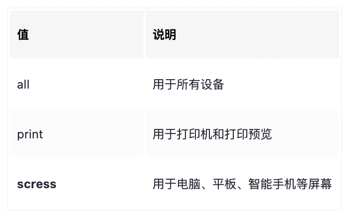

# Flex 布局
https://www.ruanyifeng.com/blog/2015/07/flex-grammar.html

# Rem 基础
## rem 单位
* rem 是一个相对单位，类似于em，先熟悉一下em：em是父元素的字体大小。
* 1em = 父元素字体大小。
* 10em = 10 * 父元素大小（假设父元素字体大小为12px）= 10 * 12 = 120px。
* rem的基准是相对于html元素的字体大小，比如，根元素设置font-size=12px;非根元素设置width:2rem，则12px(根元素字体大小) * 2rem = 24px。
* rem优点：可以通过修改html里面的文字大小来整体控制页面元素大小。

# 媒体查询语法
* 使用 `@media` 查询，可以针对不同的媒体类型定义不同的样式。
* `@media` 可以针对不同的屏幕尺寸设置不同的样式。
* 当年充值浏览器大小的过程中，页面也会更具有浏览器的宽度和高度重新渲染页面。

## 语法：
``` css
   // 用@media开头
   // mediatype 媒体类型
   // 关键字and not only
   // media feature 媒体特性 必须有小括号包含
   @media mediatype and|not|only (media feature) {
      css-code;
   }
```

## 语法规范
### 1. mediatype查询类型
将不同的终端设备划分成不同的类型，称为媒体类型。
 
### 2. 关键词
关键词将媒体类型或多个媒体特性连接到一起作为媒体查询的条件。
* `and`：可以将多个媒体特性连接到一起，相当于“且”的意思。
* `not`：排除某个媒体类型，相当于“非”的意思，可以省略。
* `only`：指定某个特定的媒体类型，可以省略。
### 3、媒体特性


``` css
   /* 一、 小于等于700px 页面颜色为此 */
   @media screen and (max-width:539px) {
      body {
         background-color: aquamarine;
      }
   }
   
   /* 二、701~900px 页面颜色改为 红色 */
   @media screen and (min-width:540px) {
      body {
         background-color: red;
      }
   }
   
   /* 三、大于等于970时，页面颜色都为绿色 */
   @media screen and (min-width:970px) {
      body {
         background-color: green;
      }
   }
```
### 4. 媒体查询+rem实现元素动态大小变化
rem时按html来走的，有脸rem页面元素可以设置不同大小尺寸。
媒体查询可以根据不同设备宽度来修改样式。
媒体查询+rem 就可以实现不同设备的宽度，实现页面元素大小的动态变化。


``` html
<style>
  * {
      margin: 0;
      padding: 0
   }
   /* 三档 
   页面尺寸大于320字体大小为50 * 0.5px
   大于500时为75 * 0.5px
   大于800时为100 * 0.5px
   注意：* 0.5是因为我们把盒子.top内文字大小设置为了0.5rem,而rem是相对与html元素的文字大小计算的（元素文字大小 * html文字大小（默认16px）= 最终文字大小）
   */
   @media screen and (min-width: 320px) {
      html {
         font-size: 50px;
      }
   }
   @media screen and (min-width: 500px) {
      html {
         font-size: 75px;
      }
   }
   @media screen and (min-width: 800px) {
      html {
         font-size: 100px;
      }
   }
   .top {
      height: 1rem;
      font-size: .5rem;
      color: #fff;
      background-color: green;
      text-align: center;
      line-height: 1rem;
   }
</style>
<body>
<div class="top">购物车</div>
</body>
```

### 5. 引入资源
当样式比较繁多的时候，可以针对不同的媒体使用不同的样式表。就是直接在Link中判断设备的尺寸，任何引用不同的css文件。
``` css
   <link rel="stylesheet" href="style640.css" media="screen and (min-width: 640px)">
```